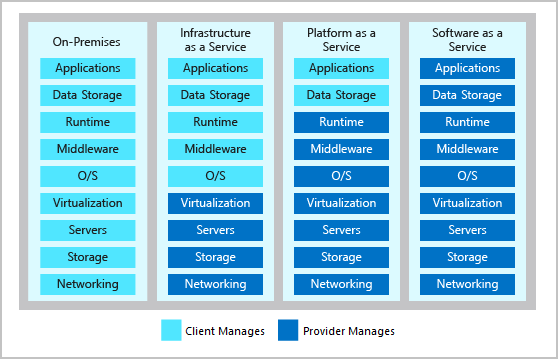
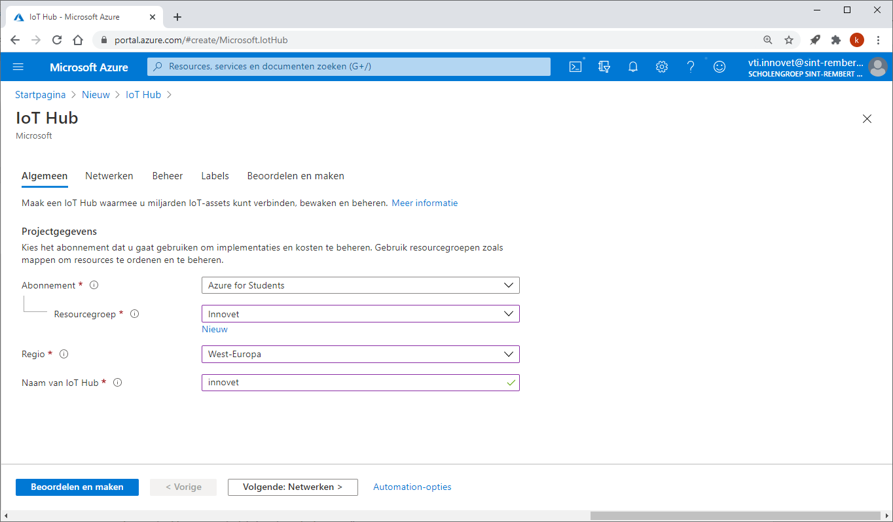
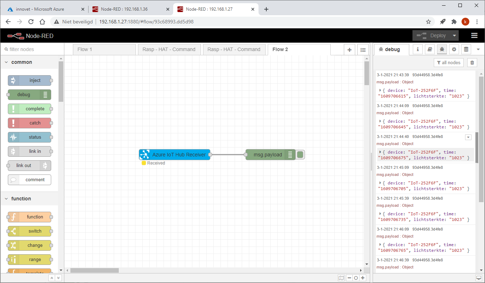
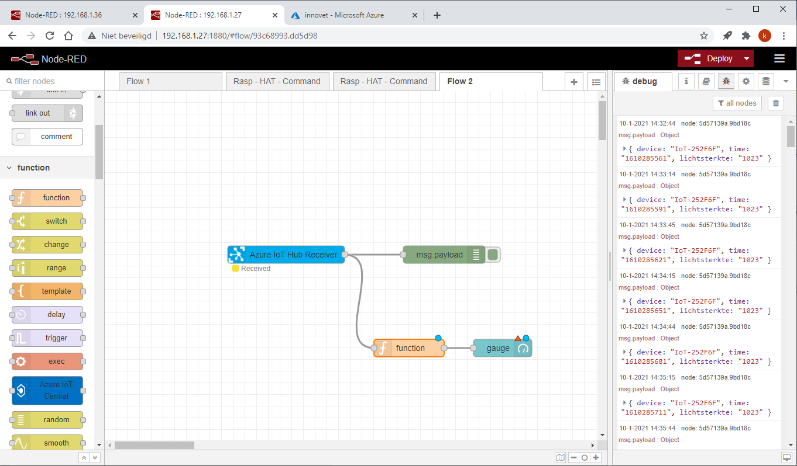
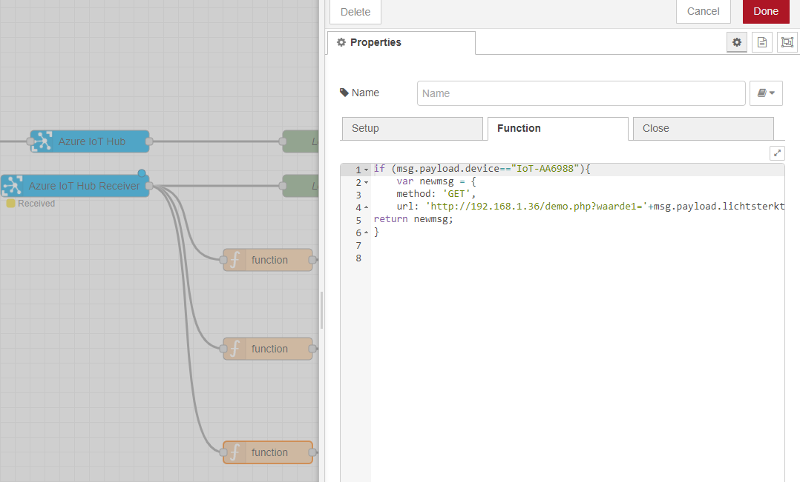

# Data van een IoT apparaat visualiseren via IoT hub en Node-RED

# Doelstelling

-   Data bewaren in een MySQL database.

-   Data visualiseren in Node-RED en exporteren naar een rekenblad.

Er wordt gebruik gemaakt van Azure IoT-Hub van Microsoft.

# Inleiding

Azure is de cloud computing omgeving van Microsoft. Bij de cloud denken we
meestal aan het online bewaren van data zoals bij onedrive of googledrive.

Bij de cloud staat de data echter altijd op een fysische server. Deze fysische
server staat echter niet bij je thuis maar in een datacenter.

Enkele voorbeelden van datacenters bij Microsoft:

<https://www.youtube.com/watch?v=80aK2_iwMOs>

<https://www.youtube.com/watch?v=9nLD7bc5O1g>

Bij cloud computing is het echter ook mogelijk om zelf virtuele servers op te
zetten zoals een webserver of een database.

Enkele voordelen van cloud computing zijn:

-   Er moet door de gebruiker geen eigen hardware en software aangekocht worden
    voor een eigen datacenter.

-   De beveiliging van de infrastructuur zit bij de cloud provider.

-   De cloud provider maakt back-ups van de gegevens waardoor deze niet verloren
    kunnen gaan.

-   De rekenkracht van het datacenter wordt verdeeld over alle gebruikers van
    het datacenter.

De gebruiker moet enkel over een computer met internettoegang en een browser
beschikken. Via een portal krijgt de gebruiker toegang tot de nodige servers.

Meer uitleg over cloud computing kan je nalezen op
<https://www.true.nl/blog/wat-is-azure/>

## Portal azure cloud


Er zijn een aantal modellen mogelijk. Zowel SaaS, Paas en IaaS zijn mogelijk met
Azure




### On-Premises 
Dit is geen cloudmodel. Alle servers, software, data en applicaties staan bij de gebruiker.


### IaaS        
Dit cloudservicemodel komt het dichtst in de buurt van het beheren van fysieke servers. Een cloudprovider houdt de hardware up-to-date, maar het onderhoud van het besturingssysteem en de netwerkconfiguratie blijft een taak van de gebruiker. Een voordeel van dit cloudservicemodel is de snelle implementatie van nieuwe toestellen. Het instellen van een nieuwe virtuele machine gaat aanzienlijk sneller dan het aanschaffen, installeren en configureren van een fysieke server. 

### PaaS        
Dit cloudservicemodel is een beheerde hostingomgeving. De cloudprovider beheert de virtuele machines en netwerkresources en de gebruiker implementeert de bijbehorende toepassingen in de beheerde hostingomgeving. 

### SaaS
In dit cloudservicemodel beheert de cloudprovider alle aspecten van de toepassingsomgeving, zoals virtuele machines, netwerkresources, gegevensopslag en toepassingen. De gebruiker hoeft alleen maar de gegevens op te geven bij de toepassing die door de cloudprovider wordt beheerd.                                                                                                                                                                          
In deze cursus gebruiken we IOT Hub wat Platform as a Service is. De visualisatie verloopt via Node-RED op een raspberry pi.


## Registratie Azure

Een gratis studentenaccount kan aangemaakt worden op
<https://azure.microsoft.com/nl-nl/free/students/>

Registreer je met je email adres van school. Wanneer je registreert met een
ander email adres, krijg je de vraag om met het email adres van de school te
registeren.


Vul je telefoonnummer in als verificatie.


Registreer je.


Ga akkoord met de voorwaarden.


## Resource groep

Wanneer je iets wil maken in Azure (IoT-Hub, IoT-Central, database, …) moet je
eerst een resource groep aanmaken om alles in te bewaren.

Kies + Een resource maken.


Geef in het zoekvenster Resource groep in


Klik op Maken.


Geef de resource groep een zelfgekozen naam en kies de dichtste locatie om de
resource groep te bewaren.


Klik vervolgens op Beoordelen en maken.


# IoT Hub 

De IoT Hub is een service met gedeeltelijke MQTT-ondersteuning (Message Queuing
Telemetry Transport), waardoor standaard arduino of python programma voor mqtt
niet kunnen gebruikt worden.


# IoT Hub aanmaken

Azure IoT-Hub is een cloud applicatie. Maak deze aan door in de portal te
klikken op “+ Een resource maken”.


Geef in het zoekvenster “IoT hub” in en klik vervolgens op “Maken”


Voorzie een naam voor de IoT Hub, kies de al aangemaakte resourcegroep en regio.



Kies bij beheer voor het type F1: Free-laag. Met de studentenaccount is het
mogelijk 1 gratis IoT-Hub op te zetten. Op de IoT-Hub kunnen verschillende
devices data publishen en subscriben.

Maak de IoT-Hub aan door op “Beoordelen en maken” te klikken.


## Een apparaat toevoegen

Voeg een IoT-apparaat toe door in het linker menu voor IoT-apparaten te kiezen
en vervolgens op “+ Nieuw” te klikken.


Vul de zelfgekozen naam van de apparaat-id in en klik op “Opslaan”. Beperk de
lengte van de zelfgekozen apparaat-id.


Om de data uit de IoT-hub weer te geven in Node-RED moet een eindpunt aangemaakt
worden.

Kies ingebouwde eindpunten in het linker menu en voeg onder Consumentengroepen
een zelfgekozen naam van een eindpunt in. Voorbeeld eindpuntiothub zoals in het
voorbeeld.


## Code voor ESP8266 en ESP32

In het voorbeeld sturen we data door met een ESP8266 of ESP32 microcontroller
(thing) naar Azure IoT-Hub.

Download het voorbeeldprogramma van volgende github pagina.
<https://github.com/VTITorhout/IoT_ESP_Azure>

De instellingen van het wifi netwerk en de verbinding met Azure is mogelijk in
de config.h file.

Vul de gegevens van het wifi netwerk in:

```cpp
#define WIFI_SSID "<ENTER WIFI SSID HERE>"
#define WIFI_PSK "<ENTER WIFI PASSWORD HERE>"
```

Zorg dat IOT-Central op false staat.

```cpp
#define IOT-Central false
```

Met volgende regel code kan ingesteld worden om de hoeveel tijd info naar Azure
verzonden wordt.

```cpp
#define IOT_UPDATE 300 //send new message to cloud every x seconds
```

Deze primaire verbindingsreeks is beschikbaar in Azure.

Kies in het linker menu voor “IoT-apparaten” en selecteer het aangemaakte
apparaat.


Kopieer de primaire verbindingsreeks uit Azure in het arduino programma.


```cpp
const char* primaireVerbindingsreeks = "Primaire Verbindingsreeks invullen";
```
Programma voor ESP8266 en ESP32Arduino programma

De ino-file:

```cpp
#include "config.h" //contains all settings needed for network & credentials
#include "src/ntp/ntp.h" //library for timekeeping (needed for httpS)
#include "src/azure/iot.h" //library to access IoT central/hub on Azure

IoT azure; //create class azure of type IoT

#if defined(ARDUINO_ARCH_ESP8266)
    #include <ESP8266WiFi.h>        //needed for MAC
#elif defined(ARDUINO_ARCH_ESP32)
    #include <WiFi.h>               //needed for MAC
#endif

#if defined USE_LAN && USE_LAN == true
    #include <SPI.h>
    #include "src/eth/ethernet.h"   //adapted version because @2.0.0 from Arduino give errors and @1.0.4 included in ESP is too old
#endif

//create enum for wired network steps
typedef enum{
    NOT_YET_INITIALIZED,    //no setup has been done
    INITIALIZED_OK,         //found Wizz hardware
    INITIALIZED_NOK,        //did not found Wizz hardware
    CABLE_DISCONNECTED,     //not connected to transport medium
    DHCP                    //received IP from DHCP
} NETWORK_STATUS;

/*Next subroutine will create a char array
    --> prefix can be given, e.g. IoT
    --> prefix will be seperated from MAC with a dash
    --> last 6 hex values of MAC of device will be added to the array
*/
void ssidPrefixMac(char* buff, const char* prefix) {
  uint8_t macAddr[6];
  WiFi.softAPmacAddress(macAddr);                   //get the MAC
  for (uint8_t i = 0; i < strlen(prefix); i++) {    //add the prefix to the array
    buff[i] = prefix[i];
  }
  buff[strlen(prefix)] = '-';                       //add a dash as seperator sign
  for (uint8_t i = 0; i < 3; i++) {                 //add the last 3 bytes of the MAC
    sprintf(&buff[strlen(prefix) + 1 + i * 2], "%02X", macAddr[i + 3]);
  }
  buff[strlen(prefix) + 7] = '\0';                  //null terminated array
}

/*Next subroutine will setup the network, depending on user needs
    --> WiFi can be used on ESP8266 or ESP32
    --> Wired network can be used on ESP8266 (through Wizznet SPI)
    --> Wired network will not work on ESP32, this is not (yet) implemented
    (different libraries need to be used, because ESP32 does have a MAC)
*/
void setupNetwork() { 
    #if defined USE_LAN && USE_LAN == true  //check if we want WiFi or Wired network connection
        NETWORK_STATUS wiredStatus = NOT_YET_INITIALIZED;
        Serial.println("ETH:\tSetup");
        //SPI.pins(6, 7, 8, 0);             //switch to flash SPI0 (extended mode)
        Ethernet.init(ETH_CS);              //set CS pin --> see config.h
        uint8_t macAddr[6];
        WiFi.softAPmacAddress(macAddr);     //will use MAC of WiFi for Wired
        //Try to get IP from DHCP
        //If failed, check why?
        while (!Ethernet.begin(macAddr, 1000, 1000)) {  //begin DHCP request with timeout of 1 second --> blocking code!
            if (wiredStatus==NOT_YET_INITIALIZED) {
                switch (Ethernet.hardwareStatus()) {
                    case 0: Serial.println("\tNo hardware detected.");
                            wiredStatus = INITIALIZED_NOK; //no hardware found
                            break;
                    case 1: Serial.println("\tWizNet W5100 detected.");
                            wiredStatus = INITIALIZED_OK; //init passed
                            break;
                    case 2: Serial.println("\tWizNet W5200 detected.");
                            wiredStatus = INITIALIZED_OK; //init passed
                            break;
                    case 3: Serial.println("\tWizNet W5500 detected.");
                            wiredStatus = INITIALIZED_OK; //init passed
                            break;
                    default:Serial.println("\tUNKNOWN hardware");
                            wiredStatus = INITIALIZED_NOK; //no usefull hardware found
                }
            }
            if (wiredStatus == INITIALIZED_OK) {
                //once initialized, check link status
                if (Ethernet.linkStatus() == LinkOFF) {
                    //first time here, print the problem
                    Serial.write("\tEthernet cable is not connected.\n");
                    wiredStatus = CABLE_DISCONNECTED;
                }
            } else {
                while (true) {
                    delay(1); // do nothing, no point running with none or unknown hardware
                }
            }
        }
        //passed DHCP init, so IP received
        wiredStatus = DHCP;
        Serial.print("\n\tGot wired IP: ");
        Serial.println(Ethernet.localIP());
    #else
        //use WiFi
        Serial.println("WIFI:\tsetup");
        WiFi.mode(WIFI_STA);
        //create hostname for device, based on prefix and mac
        char prefixedMac[3 + 1 + 6 + 1];    //prefix of 3 characters, 1 dash, 6 hex values of MAC and 1  terminating character
        ssidPrefixMac(&prefixedMac[0], "IoT");
        #if defined(ARDUINO_ARCH_ESP8266)
            WiFi.hostname(prefixedMac);
        #elif defined(ARDUINO_ARCH_ESP32)
            WiFi.config(INADDR_NONE, INADDR_NONE, INADDR_NONE); // Workaround: makes setHostname() work
            WiFi.setHostname(prefixedMac);
        #endif
        Serial.print("\tconnecting ");
        WiFi.begin(WIFI_SSID, WIFI_PSK);    //set credentials in config.h
        while (WiFi.status() != WL_CONNECTED) {
            delay(250);
            Serial.print(".");
        }
        Serial.print("\n\tGot wireless IP: ");
        Serial.println(WiFi.localIP());
    #endif
} // setupNetwork

/*Function that returns data for Azure
    User can customize this funtion to his needs
    --> this is just for demonstration
    --> JSON string with unique device ID (based on MAC) & some random data
*/
String buildPayload() {
  char prefixedMac[3 + 1 + 6 + 1];  //prefix of 3 characters, 1 dash, 6 hex values of MAC and 1  terminating character
  ssidPrefixMac(&prefixedMac[0], "IoT");  //create unique device name
  String json = "{\"device\":\""    + (String)prefixedMac +
                "\",\"timestamp\":\"" + time(nullptr) +
                "\",\"rand1\":\"" + random(1, 100000) +
                "\",\"rand2\":\"" + random(1, 100000) +
                "\"}";
  return json;
} // buildPayload

void setup() {
    Serial.begin(115200);   //debug the needed things on serial port
    while (!Serial);        //is this needed? 
    Serial.println("\r\nPWR:\tBooting ESP");
    //provide noise to the random generator --> can be left out
    #if defined(ARDUINO_ARCH_ESP8266)
        randomSeed(analogRead(A0));
    #elif defined(ARDUINO_ARCH_ESP32)
        randomSeed(analogRead(36));
    #endif
    //set a digital output to demonstrate C2D (Cloud To Device)
    pinMode(DBG_PIN, OUTPUT);
    digitalWrite(DBG_PIN, LOW); //change to default state when power on
    //setup network depending on needs (wired/wireless)
    setupNetwork();
} // setup

//two timeout counters for C2D and D2C
uint32_t lastCheckC2D, lastCheckD2C;

void loop() {
    String methodName, payload;
    AZURE_REP reply;
    #if defined USE_LAN && USE_LAN == true
        while(Ethernet.linkStatus() == LinkOFF)
            if(wiredStatus==DHCP){
                //lost connection
                Serial.println("ETH:\tEthernet cable disconnected.");
                wiredStatus = CABLE_DISCONNECTED;
            }
        }
        if(wiredStatus==DHCP){
            Ethernet.maintain();  //maintain DHCP lease for wired ethernet
        }else{
            if(wiredStatus==CABLE_DISCONNECTED){
                //linked again
                Serial.print("\tRequesting IP");
                while (!Ethernet.begin(macAddr, 1000, 1000)){
                    Serial.print(".");
                }
                //passed DHCP init, so IP received
                wiredStatus = DHCP;
                Serial.print("\n\tGot wired IP: ");
                Serial.println(Ethernet.localIP());
            }else{
                //can we ever come here?
            }
        }
    #else
        //maintain DHCP lease for WiFi?
        yield();
        //check if wifi is disconnected
        if (WiFi.status() != WL_CONNECTED) {
            WiFi.reconnect();
        }
    #endif
    if (lastCheckC2D > millis()) { //48-days overflow check of timer
        lastCheckC2D = millis();
    }
    if (lastCheckD2C > millis()) { //48-days overflow check of timer
        lastCheckD2C = millis();
    }
    azure.worker(); //check for problems (SAS renew, ...)
    //start with time
    if (ntpWorker() == SYNCHRONIZED) {
        //we are only able to do communication if time is correct
        if (!azure.isConnected()) {
            azure.setSasExpiry((uint16_t)SAS_RENEW);
            //azure is not connected/initalized
            #if defined IOT_CENTRAL && IOT_CENTRAL  == true
                //use function overloading
                azure.initAzure(SCOPE_ID, DEVICE_ID, DEVICE_KEY); //do or retry
            #else
                //use function overloading
                azure.initAzure(primaireVerbindingsreeks); //do or retry
            #endif
        } else {
            //azure is connected, we are able to transmit/receive messages
            if ((lastCheckD2C + (IOT_UPDATE * 1000) < millis()) || (lastCheckD2C == 0)) {
                Serial.println("MAIN:\tSending message... ");
                payload = buildPayload();
                reply = azure.send(payload); //Send to azure
                if (reply == AOK || reply == OK_EMPTY) {
                    Serial.println("\ttransmit succeeded");
                    lastCheckD2C = millis();
                } else {
                    Serial.print("\terror! (");
                    switch (reply) {  //you can create a custom message for every reply you got
                        case CLOCK_NOT_SET: Serial.print("Clock has not been set.");
                                            break;
                        case TLS_ERROR:     Serial.print("TLS could not be established.");
                                            break;
                        case DPS_ERROR:     Serial.print("DPS has failed.");
                                            break;
                        case UNAUTH:        //Unauthorized
                                            Serial.print("Server failed to authenticate the request.");
                                            break;
                        case BAD_REQUEST:   //bad request
                                            Serial.print("Bad format and/or request.");
                                            break;
                        case FORBIDDEN:     //forbidden
                                            Serial.print("Forbidden.");
                                            break;
                        case UNKNOWN:       Serial.print("Got an unknown reply.");
                                            break;
                        default:            //none of the above
                                            Serial.printf("%u - huh?", reply);
                                            break;
                    }
                    Serial.println(")");
                    //create 5 seconds wait to prevent overloading the service
                    if (millis() < ((IOT_UPDATE * 1000) - 5000)) {
                        delay(5000); //use delay, because unable to make subtraction
                    } else {
                        lastCheckD2C = millis() - ((IOT_UPDATE * 1000) + 5000);
                    }
                }
            }
            //once every POLL_TIME
            if (lastCheckC2D + (POLL_TIME * 1000) < millis()) {
                Serial.println("MAIN:\tChecking for new message... ");
                reply = azure.receive(methodName, payload);
                if (reply == AOK) { //there was data
                    Serial.printf("MAIN:\tmethodName: %s, payload: %s\r\n", methodName.c_str(), payload.c_str());
                    if (methodName == "ledOn") {
                        Serial.println("\tturning LED on");
                        digitalWrite(DBG_PIN, HIGH); //change to default state when power on
                    }
                    if (methodName == "ledOff") {
                        Serial.println("\tturning LED off");
                        digitalWrite(DBG_PIN, LOW); //change to default state when power on
                    }
                } else {
                    Serial.println("\tqueue empty");
                }
                lastCheckC2D = millis();
            }
        }//azure.isConnected
    }//ntpWorker==SYNCHRONIZED
} // loop
```
De config file:
```cpp
//Global settings (hardware, WiFi credentials)
    #define WIFI_SSID "YOUR-SSID-HERE"  //set to SSID to connect to
    #define WIFI_PSK "YOUR-PSWD-HERE"   //set to password of the SSID

    #define USE_LAN     false           //set true if wired network must be used
                                        //removing this setting will use WiFi
                                        //will only work with Wizznet SPI board on ESP8266
                                        //other libraries are needed for ESP32 (future?)

    #define ETH_CS  4                   //wired ethernet WIZ5500 CS pin
    
    #define DBG_PIN 2                   //LED is connected to GPIO2 on the Firebeetle ESP32 board

//Azure interface setup
    #define IOT_CENTRAL false           //set to true if we use central, if false, direct hub access will be used
    #define SAS_RENEW   15              //SAS regenerate every x minutes
    #define IOT_UPDATE  300             //send new message to cloud every x seconds
    #define POLL_TIME   60              //check for new C2D message every x seconds

//Azure credentials
    //when using hub, a primary connection string is needed (containing hostname, device and SAS key)
    //  --> you can find this connection string in the azure portal
    const char* primaireVerbindingsreeks = "HostName=xyz.azure-devices.net;DeviceId=ESP8266;SharedAccessKey=XcDOTsMyDhfFrkKu/WuajID4nx5gdrhfc1InPrLuER8=";

    //when using central, you have to provide the scope, device and key
    //  --> you can find these settings in the azure portal
    const char* SCOPE_ID = "0ne00241B52";
    const char* DEVICE_ID = "1oikfewjvtb";
    const char* DEVICE_KEY = "omvqlYa9x6+uZBGfNdfhghAjv8kRQMVaBzroOc0NDCes=";
```
Als alles goed verloopt wordt data doorgezonden naar de IoT-Hub. Dit kan
nagezien worden.

Selecteer in het linker menu “Overzicht” en scrol naar beneden. Je kan hier de
gegevens van de IoT-Hub raadplegen.


## Raspberry pi simulator met node.js

Op volgende website kan gebruik gemaakt worden van een raspberry pi simulator.
Als taal wordt gebruik gemaakt van node.js.

[https://azure-samples.github.io/raspberry-pi-web-simulator/\#getstarted](https://azure-samples.github.io/raspberry-pi-web-simulator/#getstarted)

Vul de connectionString aan in de code. Hiervoor moet eerst een nieuw apparaat
aangemaakt worden in Azure IoT-Hub.


## Een apparaat toevoegen

Voeg een IoT-apparaat toe door in het linker menu voor IoT-apparaten te kiezen
en vervolgens op “+ Nieuw” te klikken.


Vul de zelfgekozen naam van de apparaat-id in en klik op “Opslaan”.


Selecteer in het linker menu “IoT-Apparaten” en selecteer vervolgens het
aangemaakte apparaat.


Kopieer de Primaire verbindingsreeks in de connectonString van de code.


De simuator maakt verbinding met Azure IoT-Hub en stuurt de data in een json
formaat door. Start de simulator door op “Run” te klikken.


## Python op raspberry pi

Bron:
<https://docs.microsoft.com/en-us/azure/iot-hub/quickstart-send-telemetry-python>

Download de code van vanop bovenvermelde website:
<https://github.com/Azure-Samples/azure-iot-samples-python/archive/master.zip>

Vul de CONNECTION_STRING in de code in.


De connection string is te vinden in de IoT-Hub onder IoT-apparaten.


Selecteer vervolgens het apparaat en kopieer de Primaire verbindingsreeks in de
connection String van de code.


Test de code uit. In de code wordt de temperatuur van het Arduino sense hat
ingelezen en doorgestuurd naar IoT-Hub.

Code met Primaire sleutel + versturen van info van de 2 temperatuur sensoren
vanop het sense_hat bord van raspberry pi.

```python
import random  
import time
from sense_hat import SenseHat

  
from azure.iot.device import IoTHubDeviceClient, Message  

sense = SenseHat()
sense.clear()

CONNECTION_STRING = "Vul hier de connection string in"  
MSG_TXT = '{{"temperatuur1": {temperatuur1},"temperatuur2": {temperatuur2}}}'  
#MSG_TXT = '{{"messageId":{messageId},"deviceId":"RaspberryPiSenseHat","temperatuur1": {temperatuur1},"temperatuur2": {temperatuur2}}}'    
def iothub_client_init():  
    client = IoTHubDeviceClient.create_from_connection_string(CONNECTION_STRING)  
    return client  
  
def iothub_client_telemetry_sample_run():  
  
    try:  
        client = iothub_client_init()
        print ( "IoT Hub device sending periodic messages, press Ctrl-C to exit" )  
        while True:
            temperatuur1 = sense.get_temperature()
            temperatuur1=round(temperatuur1,2)
            print(temperatuur1)
            temperatuur2 = sense.get_temperature_from_pressure()
            temperatuur2=round(temperatuur2,2)
            print(temperatuur2) 
            msg_txt_formatted = MSG_TXT.format(temperatuur1=temperatuur1, temperatuur2=temperatuur2)  
            
            message = Message(msg_txt_formatted)  
            if temperatuur1 > 40:  
              message.custom_properties["temperatureAlert"] = "true"  
            else:  
              message.custom_properties["temperatureAlert"] = "false"  
  
            print( "Sending message: {}".format(message) )  
            client.send_message(message)  
            print ( "Message successfully sent" )  
            time.sleep(30)  
  
    except KeyboardInterrupt:  
        print ( "IoTHubClient sample stopped" )  
  
if __name__ == '__main__':  
    print ( "IoT Hub Quickstart #1 - Simulated device" )  
    print ( "Press Ctrl-C to exit" )  
    iothub_client_telemetry_sample_run() 
```

Bij het correct doorsturen krijg je normaal volgende boodschappen.


## Van IoT-Hub naar Node-red

Installeer indien nodig node-red op de raspberry pi. Zorg er ook voor dat
node-red automatisch opgestart wordt bij een restart van de raspberry pi.

Zie <https://nodered.org/docs/getting-started/raspberrypi>

Open node-red via de browser door het IP-adres en de poort 1880 in de browser in
te voeren:


Voeg de bibliotheek voor Azure IoT-Hub toe. Klik op de 3 horizontale strepen
rechtsboven en kies “Settings”


Kies “Palette” in de user Settings en vervolgens het tabblad “Install”


Geef bij “search modules” Azure-iot-hub in klik op “install” bij versie 0.4.0
van node-red-contrib-azure-iot-hub.


Klik terug op Install.


Indien de installatie goed verlopen is worden de Azure IoT Hub modules in het
linker menu zichtbaar.


## Info van Azure IoT Hub ontvangen

Plaats “Azure IoT Hub Receiver”


Dubbelklik op “Azure IoT Hub Receiver”


Kies in Azure IoT-Hub in het linker menu voor “Ingebouwde eindpunten” en kopieer
het “Event Hub-compatibel eindpunt”.


Plak het “Event Hub-compatibel eindpunt” in Node-RED bij “connectionString”


Voorzie een debug node en klik op deploy.


Kies rechts boven voor “debug messages”


In het debug venster rechts worden alle berichten van de IoT-hub weergegeven.



## Info weergeven op een dashbord

Voeg de bibliotheek voor het dashboard toe. Klik op de 3 horizontale strepen
rechtsboven en kies “Settings”


Kies “Palette” in de user Settings en vervolgens het tabblad “Install”


Geef bij “search modules” “node-red dashboard” in klik op “install”.


Klik nogmaals op install. (rood)

Als alles goed verlopen is zijn alle nodes voor een dashboard geïnstalleerd.

## Weergave in Node-RED dashboard

Plaats een “Gauge”


Plaats een function en leg de nodige verbindingen.


Pas de functie aan zodat de enkel de data van het gekozen device weergegeven
wordt.

```java
if (msg.payload.device=="naam device"){
var newmsg={payload: msg.payload.eigenschap.toString()}
return newmsg;
}
```

Toegepast op het voorbeeld wordt dit:

```java
if (msg.payload.device=="IoT-252F6F"){
var newmsg={payload: msg.payload.lichtsterkte.toString()}
return newmsg;
}
```


Stel de gauge in:


Druk op “Deploy”



De user interface is zichtbaar door het IP-adres op te geven, gevolgd door het
poortnummer 1880 en /ui.


## Bewaren data in MySQL op raspberry pi afkomstig van IoT-Hub

### Aanmaken database en tabel met PhpMyAdmin

Kies "Nieuw" en geef de database een naam. Voorbeeld "demoDatabase". Klik
vervolgens op Aanmaken.


Maak een tabel meetresultaten aan met 4 kolommen.


Voeg volgende kolommen toe aan de tabel meetresultaten:

-   id als int met auto_increment
-   tijdstip als DATETEIME
-   waarde1 als float
-   waarde2 als float


### PHP en MySQL

Met PhP is het mogelijk info afkomstig van een browser of microcontroller via
een GET request in een database te plaatsen.

Als voorbeeld worden 2 waardes in de tabel "demoTabel" bewaard in de database
demoDatabase.

Maak deze tabel en database aan indien ze nog niet bestaan.

Voorbeeldcode:

```php
<?php
$servername = "localhost"; //indien het php bestand en de database beide op dezelfde computer staan.
$username = "root";
$password = "password";  //Gebruik het opgegeven paswoord  
$dbname = "demoDatabase";     //database naam

//Parameter 1 via GET in variabele waarde plaatsen
if(isset($_GET["waarde1"])){
    $varWaarde1 = $_GET["waarde1"];
} 
else { 			//indien geen parameters opgegeven
    echo "ERROR no key defined in URL!";
    die();
}
echo $varWaarde1;

//Parameter 2 via GET in variabele waarde plaatsen

if(isset($_GET["waarde2"])){
    $varWaarde2 = $_GET["waarde2"];
} 
else { 			//indien geen parameters opgegeven
    echo "ERROR no key defined in URL!";
    die();
}
echo $varWaarde2;

// Create connection
$conn = new mysqli($servername, $username, $password, $dbname);
// Check connection
if ($conn->connect_error) {
    die("Connection failed: " . $conn->connect_error);
} 
echo "Connection successfully";

//Opstellen query om het tijdstip + de waardes in de database te bewaren.
$sql = "INSERT INTO demoTabel (tijdstip,waarde1,waarde2) VALUES (NOW(),$varWaarde1,$varWaarde2)";

//querry uitvoeren
if ($conn->query($sql) === TRUE) {
    echo "New record created successfully";
} else {
    echo "Error: " . $sql . "<br>" . $conn->error;
}
$conn->close();
?>
```

Bewaar het bestand als dataToMySQL.php en plaats het php bestand via filezilla
in de map var/www/html.

Test de werking van het php bestand door 2 waardes via een GET request mee te
geven in de browser.


## Node-RED:

De data afkomstig van Azure IoT-Hub wordt opgehaald en doorgezonden via een http
get-request naar het php bestand.


Voorzie een function blok om de nodige data te filteren en deze door te sturen
naar het php bestand via een GET request.

De functie:

```java
if (msg.payload.device=="naam device"){
    var newmsg = {
    method: 'GET',
    url: 'http://192.168.1.36/demo.php?waarde1='+msg.payload.door te sturen eigenschap };
return newmsg;
}
```

Toegepast op het voorbeeld:

```java
if (msg.payload.device=="IoT-AA6988"){
    var newmsg = {
    method: 'GET',
    url: 'http://192.168.1.36/demo.php?waarde1='+msg.payload.lichtsterkte };
return newmsg;
}

```



De instellingen van de http request


Als alles goed verlopen is kan je de meetresultaten zien in de database


De meetresultaten kunnen als een CSV-bestand geëxporteerd worden naar een
rekenblad.


Het CSV-bestand kan vervolgens geopend worden in een rekenblad.

[](https://app.netlify.com/sites/innovet-iot-hub/deploys)